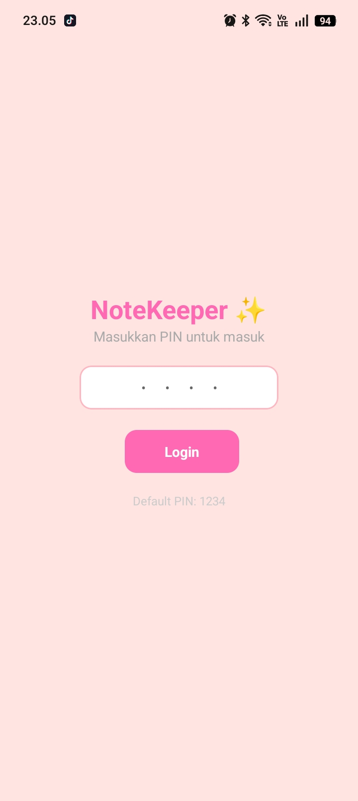
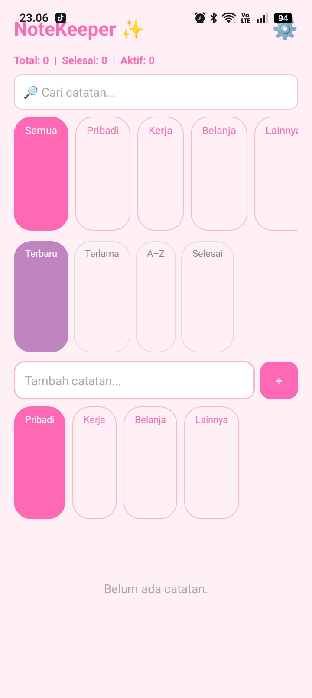
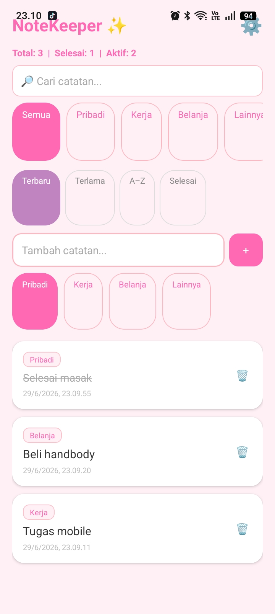
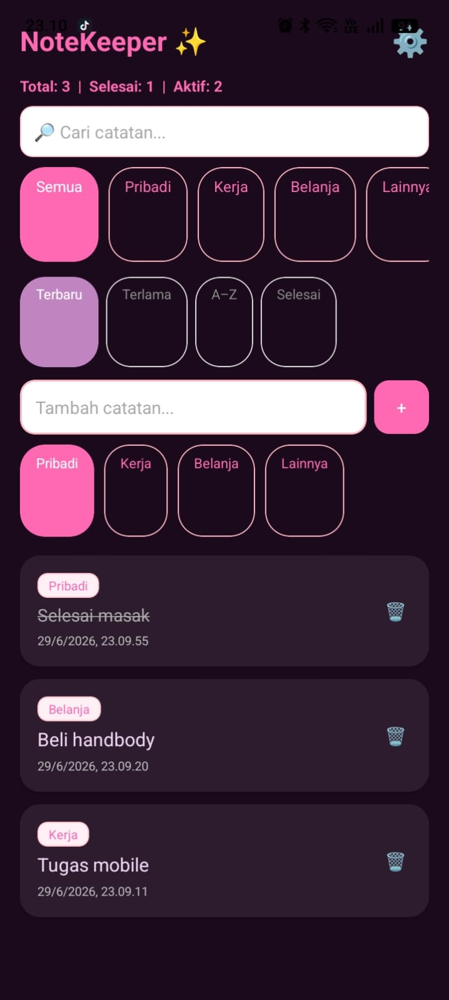

# 📋 React Native Todo List App

Aplikasi Todo List sederhana menggunakan **React Native + Expo** dengan penyimpanan lokal menggunakan **AsyncStorage** sehingga data tetap tersimpan meskipun aplikasi ditutup.

---

## ✨ Fitur

### 🟢 Level 1 (Wajib) ✅

- ✅ CREATE — Menambahkan item baru melalui TextInput
- ✅ Validasi input kosong
- ✅ READ — Memuat data dari AsyncStorage saat aplikasi dibuka
- ✅ DELETE — Menghapus item
- ✅ Menyimpan data otomatis ke AsyncStorage
- ✅ FlatList dengan keyExtractor
- ✅ Empty State ketika daftar kosong
- ✅ Data tetap tersimpan setelah aplikasi ditutup

---

### 🟡 Level 2 (Dipilih)

- ✅ ✏️ Update / Toggle Status Selesai
  - Item dapat ditandai selesai.
  - Teks dicoret ketika selesai.

- ✅ 🌙 Dark Mode Tersimpan
  - Tema dapat diubah.
  - Preferensi tema disimpan di AsyncStorage.

- ✅ 🔎 Search
  - Mencari item berdasarkan nama.

- ✅ 🗑️ Konfirmasi Hapus
  - Menggunakan Alert sebelum item dihapus.

- ✅ 🧹 Hapus Semua
  - Menghapus seluruh data Todo tanpa menghapus data aplikasi lainnya.

---

### 🔴 Level 3 (Bonus)

- ✅ Kategori 
- ✅ Sorting
- ✅ Timestamp
- ✅ SecureStore (PIN sederhana)

---

# 📱 Screenshot

| PIN | Tampilan Awal | Sebelum Tutup App | Sesudah Tutup  App | Dark Mode |
| :---: | :---: | :---: | :---: | :---: |
|  |  |  |  |  |

---

# 🔗 Demo

[Cek di Expo Snack](https://snack.expo.dev/@crisdayanti/pertemuan-12---crisdayanti)

# 🚀 Cara Menjalankan

1. Clone repository

```bash
git clone 
```

2. Masuk ke folder project

```bash
cd note-keeper
```

3. Install dependency

```bash
npm install
```

4. Jalankan Expo

```bash
npx expo start
```

5. Scan QR Code menggunakan Expo Go.

---

# 🛠 Tech Stack

- React Native
- Expo
- JavaScript (ES6)
- AsyncStorage
- Expo Secure Store

---

# 📦 Dependency

- @react-native-async-storage/async-storage
- expo-secure-store
- react-native

---

